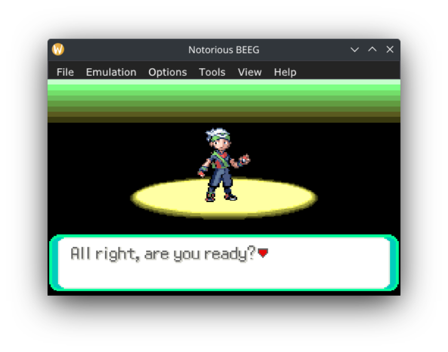

# gba emu

gb / gbc / gba emulator witten in c++23.

|                          |                          |
:-------------------------:|:-------------------------:
 | 
 | 
 | 


notable features:
- reasonably accurate gba emulation, most games should just work.
- waitloop detection. can remove most idle loops which improves performance.
- very fast gb/gbc emulation.
- reasonably accurate gb/gbc emulation.
- complete ezflash emulation, this is the only emulator with this feature.
- emulation of most fat devices used in dkp libfat. this means you can access files from a virtual sd card with homebrew. i believe this is the only emulator that supports this.
---

## building

a c++23 compiler is needed (gcc12+ clang15+ msvc12+) and cmake.

### sdl2 vcpkg (simple frontend)

```sh
cmake --preset sdl2-vcpkg
cmake --build --preset sdl2-vcpkg
```

### imgui vcpkg (complex debugger frontend)

```sh
cmake --preset imgui-vcpkg
cmake --build --preset imgui-vcpkg
```

you can checkout the rest of the presets in

there are a number of presets to help with building

---

## web builds

web builds are the easiest way to quickly test a game. builds are automatically built from master. please report any bugs you find, giving as much info as possible such as browser, os, game etc.

[gh-pages](https://itotaljustice.github.io/notorious_beeg) version doesn't support threads / mutexs. may crash.

[netlify](https://notorious-beeg.netlify.app) version supports threads / mutexes, won't crash.

---

## yet to implement

list of stuff that i haven't yet implemented. for the most part, everything is done!

### ppu
- mosaic bg
- mosaic obj

### apu
- correct fifo <https://github.com/mgba-emu/mgba/issues/1847>

### dma
- dma3 special

### misc
- correct openbus behaviour
- correct rom access timings
- lots of optimisations. ppu rendering is not optimised at all. dma can be further optimised. mem access can be better optimised for vram and bios access

---

## thanks
- cowbite spec <https://www.cs.rit.edu/~tjh8300/CowBite/CowBiteSpec.htm>
- gbatek <https://problemkaputt.de/gbatek.htm>
- tonc <https://www.coranac.com/tonc/text/toc.htm>
- belogic for apu <http://belogic.com/gba/>
- dillion for flashmem <https://dillonbeliveau.com/2020/06/05/GBA-FLASH.html>
- dennis for eeprom <https://densinh.github.io/DenSinH/emulation/2021/02/01/gba-eeprom.html>
- emudev discord
- jsmolka for their very helpful tests <https://github.com/jsmolka/gba-tests>
- normmatt (and vba) for the builtin bios <https://github.com/Nebuleon/ReGBA/tree/master/bios>
- endrift for mgba <https://github.com/mgba-emu/mgba>
- ocornut for imgui <https://github.com/ocornut/imgui>
- ocornut for imgui_club <https://github.com/ocornut/imgui_club>
- everyone that has contributed to the bios decomp <https://github.com/Gericom/gba_bios>
- xproger for openlara (fixed several bugs in my emu) <https://github.com/XProger/OpenLara>
- zayd for info on rtc <https://beanmachine.alt.icu/post/rtc/>
- pokeemerald for a being a good reference <https://github.com/pret/pokeemerald>
- kenney for the onscreen control buttons <https://www.kenney.nl/assets/onscreen-controls>
- ifeelfine for yoshi gif <https://tenor.com/view/yoshi-bloated-cute-gif-12835998>
